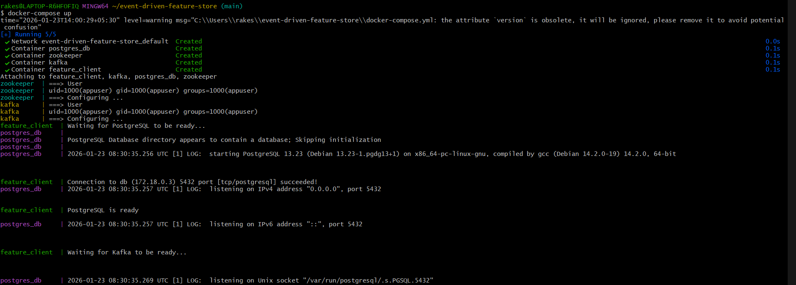
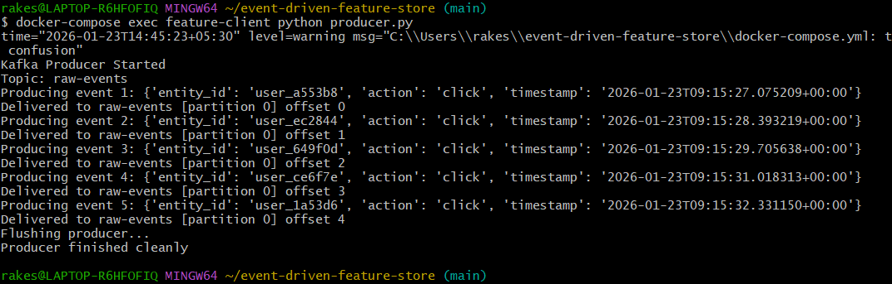
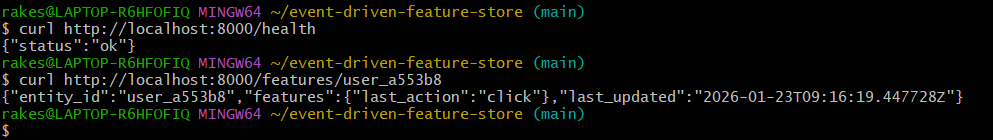

# Event-Driven ML Feature Store (Kafka + PostgreSQL)

## Overview

This project implements a **production-grade, event-driven Machine Learning Feature Store client** using **Apache Kafka**, **PostgreSQL**, and **Python**.

The system ingests real-time events via Kafka, transforms them into ML-ready features, stores them idempotently in PostgreSQL, and serves features through a low-latency FastAPI service.  
It is designed following **event-driven architecture, MLOps best practices, and production reliability principles**.

---

## Architecture Overview

```
Producer (producer.py)
|
v
Kafka Topic (raw-events)
|
v
Feature Consumer (Kafka Consumer)
|
v
PostgreSQL Feature Store
|
v
FastAPI Serving Layer
```

---

### Key Design Choices

- **Kafka** for real-time, scalable ingestion
- **PostgreSQL** for strong consistency & idempotent feature storage
- **UPSERT (ON CONFLICT)** for duplicate-safe writes
- **FastAPI** for stateless, read-optimized feature serving
- **Docker Compose** for full system orchestration

---

## Project Structure

```

event-driven-feature-store/
├── docker-compose.yml
├── Dockerfile
├── Makefile
├── producer.py
├── run_app.sh
├── requirements.txt
├── .env.example
├── sql/init.sql
├── src/
│ ├── main.py
│ ├── __main__.py
│ ├── api.py
│ ├── consumer.py
│ ├── db_manager.py
│ ├── models.py
│ └── logging_config.py
├── tests/
│ ├── conftest.py
│ ├── test_db_manager.py
│ ├── test_consumer.py
│ ├── test_api.py
├── logs/app.log
├── docs/api.md
└── docs/screenshots/

```

---

## Screenshots

### Docker Services Running



### Kafka Producer Generating Events



### Feature Retrieval API Response



### Test Execution


---

## Setup Instructions

### 1️.Clone the repository

```bash
git clone https://github.com/rakeshchinni77/event-driven-feature-store
cd event-driven-feature-store
```

2️.Environment Variables

```
cp .env.example .env
```

3️.Start all services

```bash
docker-compose up --build
```

### This brings up:

Kafka

Zookeeper

PostgreSQL

Feature Store service (FastAPI)

---

## Producing Sample Events

To generate real-time events into Kafka:

```bash
docker-compose exec feature-client python producer.py
```

This simulates user activity and pushes events into the raw-events Kafka topic.

## API Usage

Get Features for an Entity

```
GET /features/{entity_id}
```

Example:

```
curl http://localhost:8000/features/user_123
```

Response:

```
{
  "entity_id": "user_123",
  "features": {
    "last_action": "click"
  },
  "last_updated": "2026-01-23T09:16:19Z"
}

```

See full API details in docs/api.md.

---

### PostgreSQL Schema (Idempotency Core)

```
CREATE TABLE IF NOT EXISTS features (
    entity_id VARCHAR(255) NOT NULL,
    feature_name VARCHAR(255) NOT NULL,
    feature_value TEXT NOT NULL,
    timestamp TIMESTAMPTZ DEFAULT CURRENT_TIMESTAMP,
    PRIMARY KEY (entity_id, feature_name)
);
```

---

## Error Handling & Resilience

Kafka offset commit AFTER DB write

Retries with exponential backoff for PostgreSQL

No offset commit on failure

Graceful shutdown handling

Schema validation using Pydantic

---

### Running Tests

```bash
docker-compose exec feature-client pytest
```

All unit and integration tests are located in the tests/ directory.

---

## Summary

This project demonstrates:

Event-driven system design

Production-grade data pipelines

MLOps-ready feature serving

Strong engineering discipline

Designed for scalable ML systems requiring fresh, low-latency features.
